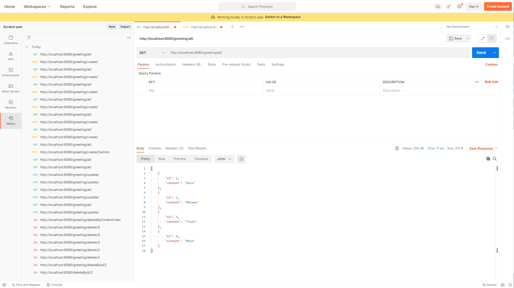
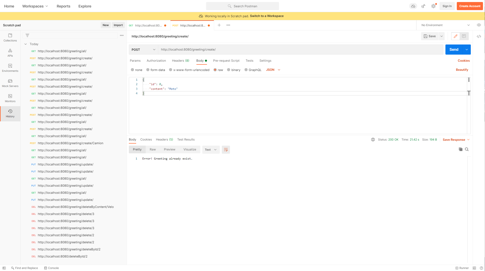
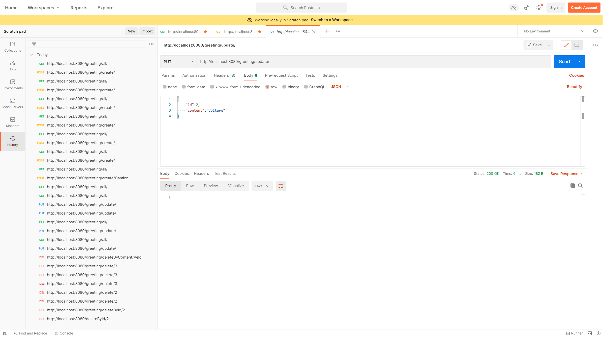
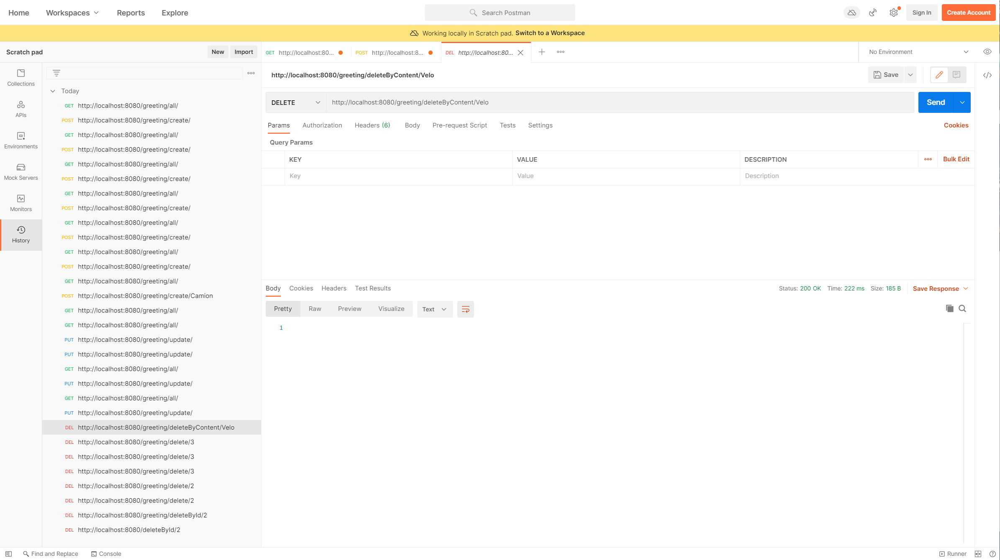

# ESIEE_3_JEE_Web_Service

> 🚨 **Projet déplacer ici ▶▶ : [https://github.com/2023-esiee-projectlab/esiee-it_2022_java_jee_web_service](https://github.com/2023-esiee-projectlab/esiee-it_2022_java_jee_web_service)**

[Aide source](https://www.youtube.com/watch?v=IucFDX3RO9U&t=13s)

## 1 - Démarrage du projet

### 1.1 - Prérequis

- Java 1.8

### 1.2 - Démarrage

`mvn spring-boot:run`

### 1.3 - Accès à l'application

http://localhost:8080

## 2 - Help - Spring

- Fichier [HELP.md](HELP.md)

## 3 - Rendu

### 3.1 - Récupéré un ou des objets

#### 3.1.1 - ✅ Méthode 1 - `/all/`

Récupérer tous les objets.

GET : http://localhost:8080/greeting/all/

```
[
    {
        "id": 1,
        "content": "Velo"
    },
    {
        "id": 2,
        "content": "Bateau"
    },
    {
        "id": 3,
        "content": "Train"
    }
]
```

Exemple en image



#### 3.1.2 - ✅ Méthode 2 - `/getById/{id}`

Récupérer un object spécifique avec un paramètre "id".

GET : http://localhost:8080/greeting/getById/1

```
{
    "id": 1,
    "content": "Velo"
}
```

#### 3.1.3 - ✅ Méthode 3 - `/getByContent/{content}`

Récupérer un object spécifique avec un paramètre "content".

GET : http://localhost:8080/greeting/getByContent/Velo

```
{
    "id": 1,
    "content": "Velo"
}
```

#### 3.1.4 - ✅ Méthode 4 - `/getByContentToString/{content}`

Récupérer un object spécifique avec un paramètre "content" et le convertir en String.

GET : http://localhost:8080/greeting/getByContentToString/Velo

```
Greeting(id=1, content=Velo)
```

### 3.2 - Ajouter un objet

#### 3.2.1 - ✅ Méthode 1 - `/create/`

Ajouter un objet.

POST : http://localhost:8080/greeting/create/

```
{
    "id": 4,
    "content": "Avion"
}
```

Exemple en image



#### 3.2.2 - ✅ Méthode 2 - `/create/{content}`

Ajouter un objet avec un paramètre "content".

POST : http://localhost:8080/create/Avion

```
{
    "id": 4,
    "content": "Avion"
}
```

### 3.3 - Modifier un object

#### 3.3.1 - ❌ Méthode 1 - `/update/id={id}&content={content}`

#### 3.3.2 - ✅ Méthode 2 - `/update/`

PUT : http://localhost:8080/greeting/update/

```
{
    "id":2,
    "content":"Voiture"
}
```

Renvoi : `Greeting 2 updated`

Exemple en image



### 3.4 - Supprimer un object

#### 3.4.1 - ✅ Méthode 1 - `/delete/{id}`

DELETE : http://localhost:8080/greeting/delete/2

```
OK ===> Check console
```

#### 3.4.2 - ✅ Méthode 2 - `/deleteById/{id}`

DELETE : http://localhost:8080/greeting/deleteById/2

```
Greeting 2 removed
```

#### 3.4.3 - ✅ Méthode 3 - `/deleteByContent/{content}`

DELETE : http://localhost:8080/greeting/deleteByContent/Velo

```
Greeting Velo removed
```

Exemple en image


